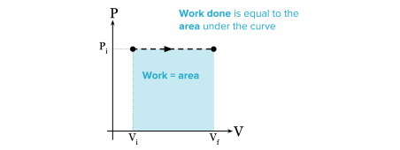
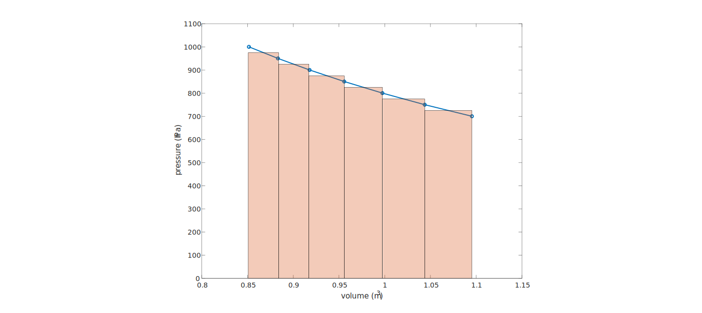

## 4. Thermodynamics II

The first two problems are in-class practice and the **last one** is a **homework assignment**, for which you should submit your script on Canvas.

### Problem 1 Specific Heats

Suppose the volume of a class room is 300 m<sup>3</sup>. For initial temperatures `T0` given be the following vector, 
* _How much heat is needed to be removed to cool the room to 21 <sup>o</sup>C_?

```
T0 = 24:33
```
Assume the pressure in the room is always the same as the pressure outside, which is constant `p = 1000` hPa. You can ignore the change in the mass of air in the room during cooling, but should be aware of the difference in initial mass (due to the difference in temperature). The specific heats at constant pressure and constant volume are 1004 and 717 J kg<sup>-1</sup> K<sup>-1</sup>, respectively. For your reference, 1 kWh = 3.6 <span>&#215;</span> 10<sup>6</sup> J.

```
T0 = 24:33;
dT = ?;  % temperature change due to cooling
cp = 1004;
rho = ?;          % density of air in the room
m = rho * 300.0;  % mass of air in the room
E = ?;            % energy needed for the cooling

% display the result
format bank
disp('       T0 (deg C)    Energy (kWh)')
disp('       ----------    ------------')
disp([T0', E'/3.6e6])
```

### Problem 2 First Law of Thermodynamics


As we mentioned in class, the first law of thermodynamics is 
\\[
\Delta U = Q - W
\\]
where \\(U \\)is internal energy, \\(Q \\)is heat supply to the system, and \\(W \\)is the work done **by** the gas system **to** its
environment. We also explained that the work
\\[
W = \int p\,dV
\\]
where \\(p \\)is pressure. If \\(p \\) is constant during the volume change, then \\(W=p\Delta V \\). 


If \\(p \\)is not a constant, but you know the value of \\(p \\)as a set of points, e.g. `p = [100000, 80000, 60000, ...]`, and corresponding 
volume values, `v = [0.8, 1.0, 1.2, ... ]`, then you 
can approximate the integral by the following discretization 
\\[
\int p\,dV \approx \sum p_{k+\frac12} \Delta V = p_{1+\frac12}\Delta V + p_{2+\frac12}\Delta V + ...
\\]
where \\(p_{k+\frac12} \\) is the mean pressure between \\(p_{k} \\)and \\(p_{k+1} \\).


Now let's suppose we have an air parcel whose mass is 1 kg. It is initially at the surface (1000 hPa) and has the temperature
23.52 <sup>o</sup>C. If this air parcel is lifted to 700 hPa adiabatically (i.e. \\(Q=0 \\)), with the data of pressure and height
below, can you
* _Find out the temperature and volume of this air parcel at the pressure levels given by the data below?_
* _Calculate the total work done by this parcel to its environment due to its expansion in volume?_

```
m = 1.0;              % mass of the parcel
T0 = 23.53 + 273.15;  % initial temperature
% pressure levels
p = [100000.00, 95000.00, 90000.00, 85000.00, 80000.00, 75000.00, 70000.00];
% geopotential height
z = [0, 442.79, 904.90, 1390.45, 1901.95, 2441.31, 3012.19];
 
% temperature at each pressure/height level
T = ?;
% density at each level
rho = ?;
% volume at each level
V = m ./ rho;
% change in volume between adjacent levels
dV = ?;
% average pressure at half levels
pAvg = ?;
% work done for each level change
dW = ?;
% total work
W = ?;
% change in internal energy
dU = ?;
format bank
disp(' ')
disp('        dU            -W')
disp('     ---------     ---------')
disp([dU, -W])
```

### Problem 3 Static Stability<sup>*</sup>
  <sup>*</sup> _This is a homework assginment and you need to submit your code on Canvas_
  
  
_**TO BE RELEASED BEFORE CLASS**_


### Appendix: _**Decisions**_

The `if` construct is the basis of decision making. The simplest form of `if` in a single line is
```
if condition; statements; end
```
For this one-line `if` construct,
* `condition` is usually a _logical expression_ (i.e., it contains a _relational operator_), which is either _true_ or _false_. The relational operators are shown in Table 4.1. 
* If `condition` is true, _statement_ is executed, but if _condition_ is false, nothing happens.

**Table 4.1** Relational operators

| Relational operator | Meaning |
|:------------------- |:------- |
| <    | less than |
| <=   | less than or equal |
| ==   | equal |
| ~=   | not equal |
| >    | greater than |
| >=   | greater than or equal |

#### _Exercises_

The following statements all assign logical expressions to the variable `x`. See if you can correctly determine the value of `x` in each case before checking your answer with MATLAB.
```
>> x = 3>2
>> x = 2>3
>> x = -4<=-3
>> x = 1<1
>> x = 2~=2
>> x = 3==3
>> x = 0<0.5<1
```
Can you determine the last one correctly?

A slightly more complicated `if` construct include the keyword `else`. The basic form of `if-else` for use in a program file is
```
if condition
   statementsA
else
   statementsB
end
```
in which 
* statementsA and statementsB represent one or more statements.
* if `condition` is true, `statementsA` are executed, but if `condition` is false, `statementsB` are executed. 
* `else` is optional.

#### _Exercises_

Most banks offer differential interest rates. Suppose the rate is 9% if the amount in your savings account is less than $5000, but 12% otherwise. The Random Bank goes one step further and gives you a random amount in your account to start with! (by the command `rand` below) Run the following program  a few times:
```
format bank
bal = 10000 * rand
if bal < 5000
   rate = 0.09
else
   rate = 0.12
end
newbal = bal + rate*bal
```

The more complicated `if` construct includes `elseif`. 
```
if condition 1
     statementsA
elseif condition2
     statementsB
elseif condition3
     statementsC
...
else
     statementsE
end
```

This is called an `elseif` _ladder_. It works as follows:

* `condition1` is tested first. If it is true, `statementsA` are executed; MATLAB then moves to the next statement after `end`.
* If `condition1` is false, MATLAB checks `condition2`. If it is true, `statementsB` are executed, followed by statement after `end`.
* In this way, all conditions are tested until a true one is found. As soon as a true condition is found, no further `elseif`s are examined and MATLAB jumps off the ladder.
* If non of the conditions is true, statements after `else` are executed.
* There can be any number of `elseif`s, but at most one `else`. 

#### _Exercises_

Suppose the Random Bank now offers 9% interest on balances of less than $5000, 12% for balances of $5000 or more but less than $10000, and 15% for balances of 10,000 or more. The following program caculates a customer's new balance after one year according to this scheme, for ten random initial balance created with the command `rand`.

```
bal = 15000 * rand(1,10);
newbal = zeros(1,10);   % initialize newbal to be zeros
rate = zeros(1,10);     % initialize rate to be zeros
for i = 1:10
    if bal(i) < 5000
        rate(i) = 0.09;
    elseif bal < 10000
        rate(i) = 0.12;
    else
        rate(i) = 0.15;
    end
end 
newbal = bal + rate .* bal;
format bank
disp('Initial Balance         Rate      New Balance')
disp([bal' rate' newbal'])
```

More complicated logical expressions can be constructed using the three _logical operators_: `&` (and), `|` (or), `~` (not). For example, the quadratic equation
\\[
a x^2 + bx +c = 0
\\]
has equal roots, given by \\( -b/2a\\), provided that \\(b^2-4ac=0\\) and \\(a\neq 0\\). This translates into the following MATLAB statements:
```
if (b^2 -  4*a*c == 0) & (a ~= 0)
    x = -b / (2*a) ;
end
```
Of course, `a`, `b`, and `c` must be assgined values prior to using this set of statements.


