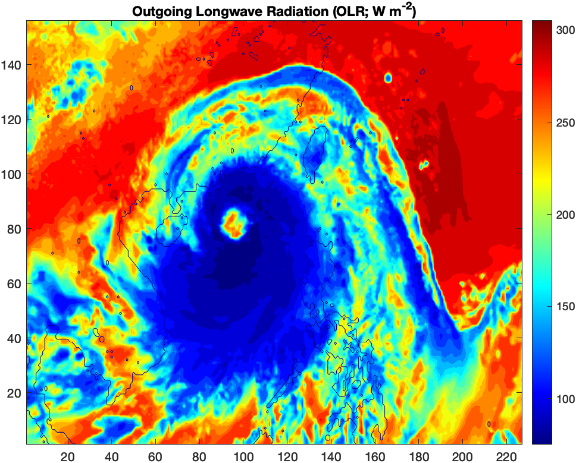

## Radiation I

In today's exercises, you will learn how to use radiation principles in weather observation and planetary science. 

**The 2nd problem is a homework assignment. Please submit your code and an one-page explanation of the calculation you did.**

### Problem 1 Outgoing Longwave Radiation

Observed data of outgoing longwave radiation (OLR) for a weather event is provided on Canvas. You will explore this data to understand how remote sensing works.

Firstly, let's load and take a look at the data
```matlab
% load data 
load OLR1.mat 
% look at what we have 
f1 = figure;
contourf(olr, (75:10:305), 'LineColor', 'none')
colormap("jet")
colorbar
caxis([75 305]);
title('Outgoing Longwave Radiation (OLR; W m^{-2})')
hold on
contour(landmask, [0.5 0.5]) 
hold off
```
Running this code in MATLAB/OCTAVE, you should see the figure below,


Now please **calculate the equivalent blackbody temperature** and plot it.
```
[FILL YOUR OWN CODE HERE AND SAVE AS 'T']

f2 = figure;
contourf(T, (190:5:270), 'LineColor', 'none')
colormap("jet")
colorbar
caxis([190 260]);
title('Equivalent Blackbody Temperature (K)')
hold on
contour(landmask, [0.5 0.5]) 
hold off
```

We know that temperature decreases with height, so we can calculate an 'emission height' of OLR. Assume that the lapse rate in the atmosphere is 6.5 K/km and surface temperature is 20 <sup>o</sup>C, please calculate the 'emission height' corresponding to the equivalent blackbody temperature `T`. 
```
% assume surface temperature is 20 degree C, and lapse rate is 6.5 K/km
H = [FILL YOUR OWN CODE HERE]

f3 = figure;
contourf(H, (1:1:16), 'LineColor', 'none')
colormap("jet")
colorbar
caxis([1 16]);
title('Equivalent Emission Height (km)')
hold on
contour(landmask, [0.5 0.5]) 
hold off
```

_Can you now see what weather system this is in the figures?_

### Problem 2 Equivalent Blackbody Temperature of Planets<sup>*</sup>

**<sup>*</sup>This is a homework assignement and you need to submit your code and answer**

Given the data in the table below, please calculate flux density of solar radiation at the top of the atmosphere of those planets _F<sub>s</sub>_, and their equivalent blackbody temperature, _T<sub>e</sub>_.

| Planet        | Distance from Sun | F<sub>s</sub> (W m<sup>-2</sup>)  | Albedo | T<sub>e</sub> |
|:------------- |:-------------:|:------:|:-----:|:-----:|
| Mercury       | 0.39 | ? | 0.06 | ? |
| Venus         | 0.72 | ? | 0.78 | ? |
| Earth         | 1.00 | 1368 | 0.30 | ? |
| Mars          | 1.52 | ? | 0.17 | ? |
| Jupiter       | 5.18 | ? | 0.45 | ? |

Here the distances are expressed in _astronomical units_, which are multiples of Earth-Sun distance.

